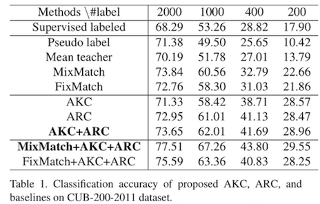

# Adaptive Consistency Regularization for Semi-Supervised Transfer Learning

This repository is for Adaptive Knowledge Consistency and Adaptive Representation Consistency introduced in the following paper:
 
Abulikemu Abuduweili, Xingjian Li, Humphrey Shi, Cheng-Zhong Xu, and Dejing Dou, [Adaptive Consistency Regularization for Semi-Supervised Transfer Learning](https://arxiv.org/abs/2103.02193), CVPR 2021.  
 

## Contents
1. [Introduction](#Introduction)
2. [Tasks](#Tasks)
3. [Citation](#citation)


## Introduction
In this work, we consider semi-supervised learning and transfer learning jointly, 
leading to a more practical and competitive paradigm that can utilize both powerful pre-trained models from source domain as well as labeled/unlabeled data in the target domain. 
To better exploit the value of both pre-trained weights and unlabeled target examples, we introduce adaptive consistency regularization that consists of two complementary components: 
Adaptive Knowledge Consistency (AKC) on the (labeled and unlabeled) examples between the source and target model, 
and Adaptive Representation Consistency (ARC) on the target model between labeled and unlabeled examples. 
Examples involved in the consistency regularization are adaptively selected according to their potential contributions (measured by prediction entropy) to
the target task.  Moreover, our algorithm is orthogonal to existing methods and thus able to gain additional improvements on top of the existing semi-supervised learning methods.


## Tasks
### Semi-supervised transfer learning 
AKC and ARC regularization terms could be combined with other semi-supervised learning methods, 
like MixMatch and FixMatch. By utilizing AKC and ARC regularization techniques in MixMatch, the performance increased notably.

Results on CUB-200-2011 dataset:  


The actual sample selected ratio in ARC and AKC is shown in Figure 2 on CUB-200-2011 dataset experiment. 
As can be seen, the sample selected ratio for ARC is gradually increasing. Which can be regarded as a kind of curriculum learning.  


### Supervised transfer learning 
Both AKC and ARC improve the performance of standard transfer learning.    


### Effectiveness of transfer learning in semi-supervised setting
In previous works, the effectiveness of transfer learning in semi-supervised settings was underestimated. 
With the Imprinting technique and proper training strategy, transfer learning could lead to a noticeable improvement, especially when labeled examples are insufficient.

Results of SSL methods with and without transfer learning on CIFAR-10:  
  


## Citation
If you find the code helpful in your resarch or work, please cite the following papers.
```BibTex
@inproceedings{abuduweili2021adaptive,
  title={Adaptive Consistency Regularization for Semi-Supervised Transfer Learning},
  author={Abuduweili, Abulikemu and Li, Xingjian and Shi, Humphrey and Xu, Cheng-Zhong and Dou, Dejing},
  booktitle={Proceedings of the IEEE/CVF Conference on Computer Vision and Pattern Recognition},
  pages={6923--6932},
  year={2021}
}
```
