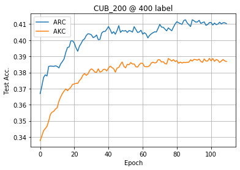

# Adaptive Consistency Regularization for Semi-Supervised Transfer Learning

This repository is for Adaptive Knowledge Consistency and Adaptive Representation Consistency introduced in the following paper:
 
Abulikemu Abuduweili, Xingjian Li, Humphrey Shi, Cheng-Zhong Xu, and Dejing Dou, [Adaptive Consistency Regularization for Semi-Supervised Transfer Learning](https://arxiv.org/abs/2103.02193), CVPR 2021.  
 

## About the code
The code is developed on CentOS 6.3 environment (Python 3.6, PyTorch 1.1, CUDA 9.0) with Tesla V100 GPUs.   
Please check the core training part of the code in [train.py](ssl_lib/trainer/train.py); check the implementation of ARC and AKC in [regularizer.py](ssl_lib/consistency/regularizer.py).  
For the hyperparameter in [parser.py](parser.py),  `lambda_kd` represents the regularization weight factors for AKC, and `lambda_mmd` represents the regularization weight factors for ARC;
`kd_threshold` and `mmd_threshold` are the threshold value for AKC and ARC;
`mmd_feat_table_l` and `mmd_feat_table_u` represent the ARC buffer size for the labeled data and for the unlabeled data.

## How to run the code

### Run on CUB-200-2011

1) Download the [CUB-200-2011 dataset](http://www.vision.caltech.edu/visipedia/CUB-200-2011.html) in your data folder, e.g. `./data/`.
2) Pretrain the ResNet-50 model on [Imagenet](http://image-net.org/download-images) or download the Imagenet pretrained models from [pytorch.models](https://download.pytorch.org/models/resnet50-19c8e357.pth) in your checkpoint folder, e.g. `./ckpt/`. Then rename the pretrained checkpoint as `resnet_50_1.pth`.  
PS: The output of our model is slightly different from the original ResNet-50 model, please check the code.
3) In [parser.py](parser.py), `lambda_kd` represents the regularization weight factors for AKC, and  `lambda_mmd` represents the regularization weight factors for ARC.   
4) run [main.py](main.py) on CUB-200-2011 dataset.  
 
e.g: Train the models with ARC:
```
pretrain_path="ckpt" # pretrained model path
data_root="data" # data folder
dataset=cub200
num_labels=400
arc=50 # adaptive representation consistency (semi-supervised)
akc=0 # adaptive knowledge consistency (transfer)
CUDA_VISIBLE_DEVICES=0,1 python -u main.py \
--data_root $data_root --dataset $dataset --num_labels $num_labels --pretrained_weight_path $pretrain_path  \
--lambda_mmd $arc --lambda_kd $akc 
```

The default MixMatch parameters are:   
`--coef 500 --alpha 0.75 --alg ict --consistency ms --warmup_iter 4000 --ema_teacher true --ema_teacher_train true --ema_teacher_warmup true --ema_teacher_factor 0.999`

The default FixMatch parameters are:   
`--coef 0.5 --alg pl --strong_aug true --threshold 0.95  --ema_teacher true --ema_apply_wd true --ema_teacher_factor 0.999 --cutout_size 0.5`

4) (Optional) Plot the training and evaluation results as [plot_loss.ipynb](plot_loss.ipynb).
e.g: Evaluation accuracy during an experiment on CUB_200_2011 dataset with 400 labeled examples as shown below.  
    

### Run on CIFAR-10

1) Pretrain the WideResnet-28-2 on [Imagenet-32 dataset](https://patrykchrabaszcz.github.io/Imagenet32/) with the the pretraining script [pretrain.py](pretrain.py) or download the pretrained WideResnet-28-2 from [here](ssl_lib/models/ckpt/wideresnetleaky_28_2.pth). 
Then rename the pretrained checkpoint as `wideresnetleaky_28_2.pth`.
2) run [main.py](main.py) on CIFAR-10 dataset. 

Hyper-parameters of the CIFAR-10 are quite different from CUB-200.  
The default CIFAR-10 training hyperparameters are:
` --model wideresnetleaky --depth 28 --widen_factor 2  --lr 0.001 --weight_decay 0.0005 --epochs 200 --l_batch_size 64 --ul_batch_size 448 `

For some of the algorithms, you need to set `--bn_momentum 0.1` (e.g. Fixmatch with pretraining) or  `--bn_momentum 0.001` (e.g. Fixmatch learning from scratch).

The default FixMatch hyperparameters are:    
` --coef 1.0 --alg pl --strong_aug true --threshold 0.95 --ema_teacher true  --ema_teacher_factor 0.999 --cutout_size 0.5`

The default MixMatch parameters are:   
`--coef 100 --alpha 0.75 --alg ict --consistency ms --warmup_iter 4000 --ema_teacher true --ema_teacher_train true --ema_teacher_warmup true --ema_teacher_factor 0.999`

As an example, please try the following settings for pre-trained FixMatch on CIFAR-10:
```
pretrain_path="ssl_lib/models/ckpt"
data_root="data"
dataset=cifar10
num_labels=40
arc=0 
akc=0 
CUDA_VISIBLE_DEVICES=0 nohup  python -u main.py \
--data_root $data_root --dataset $dataset --num_labels $num_labels --pretrained_weight_path $pretrain_path  \
--model wideresnetleaky --depth 28 --widen_factor 2 --l_batch_size 64 --ul_batch_size 448 \   
--lambda_mmd $arc --lambda_kd $akc  --lr 0.001 --weight_decay 0.0005 --epochs 200  \
--coef 1.0 --alg pl --strong_aug true --threshold 0.95 --ema_teacher true  --ema_teacher_factor 0.999 \
--bn_momentum 0.1  --interleave 0  --seed 10 \
>pretrained_fixmatch_${dataset}_${num_labels}.nohups 2>&1 &
```
